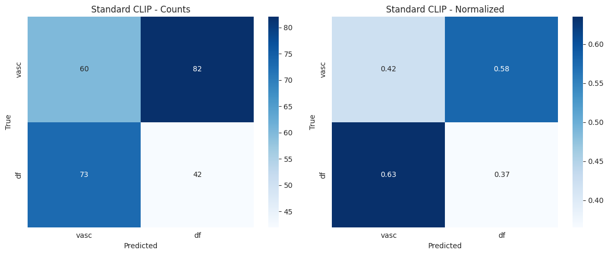
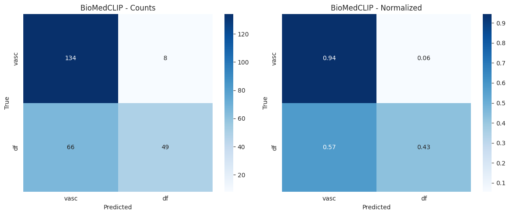
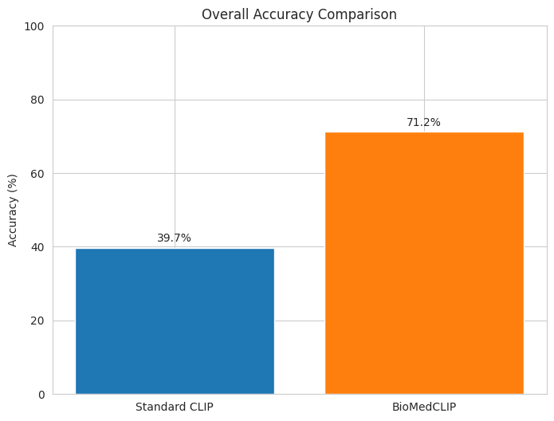
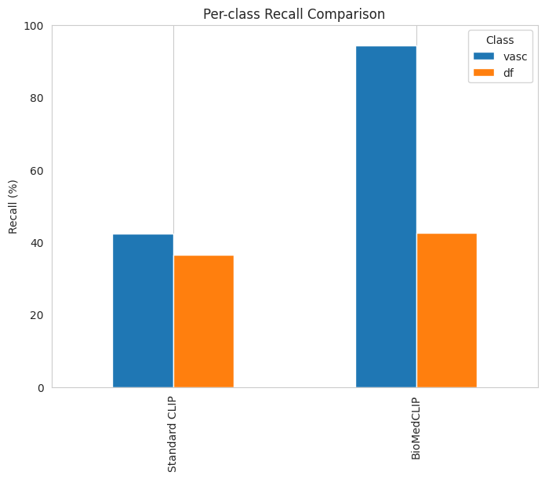
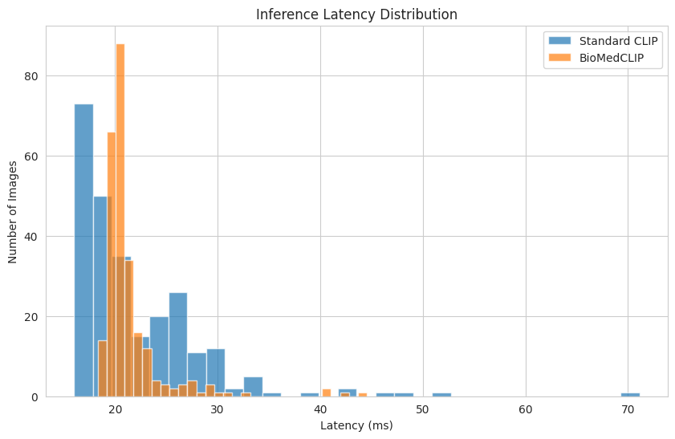
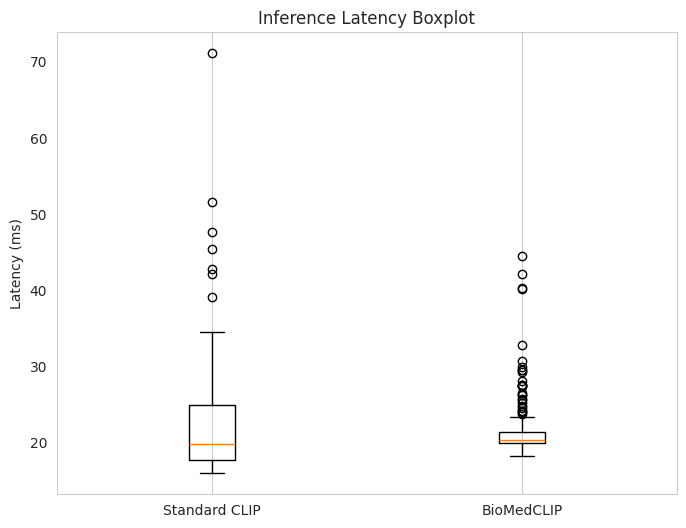

# Zero-Shot Learning for Skin Disease Classification

## 1. Introduction
This project explores zero-shot learning (ZSL) for classifying skin diseases using vision–language models. Unlike traditional supervised learning, ZSL can recognize classes that were never seen during training by leveraging textual descriptions. We compare two models:
- **Standard CLIP** (OpenAI CLIP) – pre‑trained on general images and text.
- **BioMedCLIP** – fine‑tuned on biomedical image–text pairs.

We focus on two rare skin conditions from the **HAM10000** dataset: **vascular lesions** (`vasc`) and **dermatofibroma** (`df`). These classes are treated as “unseen” – the models have not seen any labeled examples during training, only their textual descriptions.

## 2. Dataset
- **HAM10000**: 10,015 dermoscopic images of 7 skin disease classes.
- **Unseen classes**:
  - `vasc` (vascular lesions): 142 images
  - `df` (dermatofibroma): 115 images
- **Seen classes** (used only for metadata, not training): `nv`, `mel`, `bkl`, `bcc`, `akiec`.

## 3. Methodology
We use zero-shot classification by comparing image embeddings with text embeddings of class descriptions.

### 3.1 Standard CLIP
- Model: `openai/clip-vit-base-patch32`
- Prompts (single per class):
  - `vasc`: `"red and purple vascular skin spot"`
  - `df`: `"brown fibrous nodule with white scar"`

### 3.2 BioMedCLIP
- Model: `microsoft/BiomedCLIP-PubMedBERT_256-vit_base_patch16_224`
- Ensemble of two prompts per class (averaged embeddings):
  - **Vascular lesions**:
    1. `"vascular lesion, hemangioma, red to purple color, blood vessels"`
    2. `"angioma, bright red spot with distinct borders, common in elderly"`
  - **Dermatofibroma**:
    1. `"dermatofibroma, firm brown nodule, central white scar, often on legs"`
    2. `"benign fibrous histiocytoma, hyperpigmented papule, positive dimple sign"`

### 3.3 Evaluation
- **Metrics**: Overall accuracy, per‑class recall, confusion matrices, inference latency.
- **Hardware**: NVIDIA GPU (Colab).

## 4. Results

### 4.1 Overall Performance
| Model          | Overall Accuracy | Vasc Recall | DF Recall | Avg Latency (ms) |
|----------------|------------------|-------------|-----------|------------------|
| Standard CLIP  | 39.69%           | 42.25%      | 36.52%    | 22.06            |
| BioMedCLIP     | **71.21%**       | **94.37%**  | 42.61%    | 21.44            |

### 4.2 Confusion Matrices
The confusion matrices (counts and normalized) for both models are shown below.

#### Standard CLIP


#### BioMedCLIP


### 4.3 Accuracy Comparison


### 4.4 Per‑Class Recall


### 4.5 Inference Latency Distribution



### 4.6 Detailed Classification Reports

**Standard CLIP**
```
              precision  recall  f1-score  support
vasc              0.339   0.365     0.351  115.000
df                0.451   0.423     0.436  142.000
accuracy          0.397   0.397     0.397    0.397
macro avg         0.395   0.394     0.394  257.000
weighted avg      0.401   0.397     0.398  257.000
```

**BioMedCLIP**
```
              precision  recall  f1-score  support
vasc              0.860   0.426     0.570  115.000
df                0.670   0.944     0.784  142.000
accuracy          0.712   0.712     0.712    0.712
macro avg         0.765   0.685     0.677  257.000
weighted avg      0.755   0.712     0.688  257.000
```

## 5. Discussion
- **BioMedCLIP significantly outperforms standard CLIP**, achieving 71.2% overall accuracy compared to 39.7%. This demonstrates the value of domain‑specific pre‑training for medical zero‑shot tasks.
- **Vascular lesions** are recognized very well by BioMedCLIP (94% recall). The model seems to capture the “red/purple” visual cue effectively.
- **Dermatofibroma** remains challenging for both models (recall 42–43%). Possible reasons:
  - Visual similarity to other brown lesions.
  - Prompts may not fully capture the subtle dermoscopic features (e.g., central white scar, dimple sign).
- **Latency** is similar (~22 ms per image) and suitable for real‑time applications.

## 6. Future Work
- **Few‑shot learning**: Provide a few labeled examples of the unseen classes at test time.
- **Attribute‑based ZSL**: Incorporate descriptive attributes (color, shape, texture) as intermediate features.
- **Prompt engineering**: Use large language models (GPT) to generate multiple high‑quality prompts automatically.
- **Fine‑tuning**: Adapt CLIP on seen classes with contrastive learning to better align the medical domain.

## 7. Conclusion
This project shows that zero‑shot learning with vision‑language models is a viable approach for skin disease classification, especially when using a model specialized for the medical domain (BioMedCLIP). The results are promising, though further improvements are needed for harder classes.
